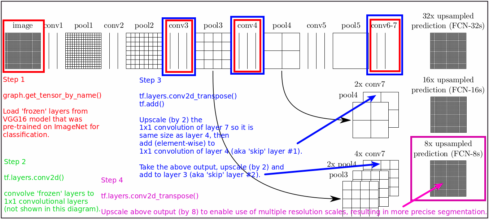
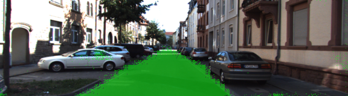
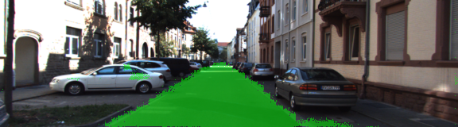

# Project Rubic
## Build the Neural Network
### 1. Pretrained VGG model loads?
```python
    tf.saved_model.loader.load(sess, [vgg_tag], vgg_path)

    graph = tf.get_default_graph()  # gives access to all the layers

    # ************************************
    # Step 1 (see FCN architecture sketch)
    # ************************************
    # grab each layer by it's name
    w1 = graph.get_tensor_by_name(vgg_input_tensor_name)  # layer 1 aka the image
    keep = graph.get_tensor_by_name(vgg_keep_prob_tensor_name)  # layer 2
    w3 = graph.get_tensor_by_name(vgg_layer3_out_tensor_name)  # layer 3
    w4 = graph.get_tensor_by_name(vgg_layer4_out_tensor_name)  # layer 4
    w7 = graph.get_tensor_by_name(vgg_layer7_out_tensor_name)  # layer 7
```
### 2. Feature learning from images (aka FCN architecture is correct)?

```python
    # ************************************
    # Step 2 (see FCN architecture sketch)
    # ************************************
    # convert output layers to 1x1 convolutional layers
    conv_1x1_layer7 = tf.layers.conv2d(vgg_layer7_out, num_classes, 1, padding='same')  # without reguliser
    conv_1x1_layer4 = tf.layers.conv2d(vgg_layer4_out, num_classes, 1, padding='same')  # without reguliser
    conv_1x1_layer3 = tf.layers.conv2d(vgg_layer3_out, num_classes, 1, padding='same')  # without reguliser
    #
    # ************************************
    # Step 3.1 (see FCN architecture sketch)
    # ************************************
    # up-sample by '2' and add 1st skip layer
    output = tf.layers.conv2d_transpose(conv_1x1_layer7, num_classes, 4, 2, 'same')  # scale up by x2
    output = tf.add(output, conv_1x1_layer4)  # 1st skip layer
    #
    # ************************************
    # Step 3.2 (see FCN architecture sketch)
    # ************************************
    # up-sample by '2' and add 2nd skip layer
    output = tf.layers.conv2d_transpose(output, num_classes, 4, 2, 'same')  # without regulariser
    output = tf.add(output, conv_1x1_layer3)  # 2nd skip layer
    #
    # ************************************
    # Step 4 (see FCN architecture sketch)
    # ************************************
    # up-sample by '8' to original image size
    output = tf.layers.conv2d_transpose(output, num_classes, 16, 8,
                                        'same')  # scale up by x8 to get original image size
    return output  # a 4D tensor
```
### 3. Is the neural network optimised?
```python
    # Define a loss measure so we can approach training a FCN like a normal classification CNN.
    #
    # Goal : assign each pixel to an appropriate class, in our case [road | not_road].
    #
    # Reshape the 4D tensor output from layers() function above into a 2D sensor of logits, where
    # rows are pixels and columns are the 2 classes.
    #
    # We can then apply the cross entropy loss function.
    #
    logits = tf.reshape(nn_last_layer, (-1, num_classes))
    correct_label = tf.reshape(correct_label, (-1, num_classes))

    cross_entropy_loss = tf.reduce_mean(
        tf.nn.softmax_cross_entropy_with_logits(logits=logits, labels=correct_label))
    optimizer = tf.train.AdamOptimizer(learning_rate).minimize(cross_entropy_loss)

    return logits, optimizer, cross_entropy_loss
```
### 4. Is the neural network trained?
```python
    #Train neural network and print out the loss during training.
    #
    for epoch in range(epochs):
        for batch, (image, label) in enumerate(get_batches_fn(batch_size)):
            feed_dict = {input_image: image, correct_label: label, keep_prob: 0.5, learning_rate: 1e-5}
            _, loss = sess.run([train_op, cross_entropy_loss], feed_dict=feed_dict)
            print('Epoch ', epoch, ' Batch ', batch, ' Loss ', loss)
```
## Neural Network Training
### 1. With training, does the model loss decrease over time?

```bash
Epoch  0  Batch  0  Loss  52.203
...
Epoch  54  Batch  144  Loss  0.0526178
...
Epoch  88  Batch  144  Loss  0.0426374
```
### 2. Reasonable hyperparameters used?
```python
    #epochs = 6  # road / not_road spread evenly across image aka garbage results!
    #epochs = 55  # OK results but seems loss may decrease even further with more epochs.
    epochs = 89  # Better results but not worth training further.
    batch_size = 2
```
### 3. ~= 80% of road is labelled correctly?
Training with epoch = 55 and batch size = 2 produces OK results.

Training with epoch = 89 and batch size = 2 produces better results.

---
# Semantic Segmentation
### Introduction
In this project, you'll label the pixels of a road in images using a Fully Convolutional Network (FCN).

### Setup
##### Frameworks and Packages
Make sure you have the following is installed:
 - [Python 3](https://www.python.org/)
 - [TensorFlow](https://www.tensorflow.org/)
 - [NumPy](http://www.numpy.org/)
 - [SciPy](https://www.scipy.org/)
##### Dataset
Download the [Kitti Road dataset](http://www.cvlibs.net/datasets/kitti/eval_road.php) from [here](http://www.cvlibs.net/download.php?file=data_road.zip).  Extract the dataset in the `data` folder.  This will create the folder `data_road` with all the training a test images.

### Start
##### Implement
Implement the code in the `main.py` module indicated by the "TODO" comments.
The comments indicated with "OPTIONAL" tag are not required to complete.
##### Run
Run the following command to run the project:
```
python main.py
```
**Note** If running this in Jupyter Notebook system messages, such as those regarding test status, may appear in the terminal rather than the notebook.

### Submission
1. Ensure you've passed all the unit tests.
2. Ensure you pass all points on [the rubric](https://review.udacity.com/#!/rubrics/989/view).
3. Submit the following in a zip file.
 - `helper.py`
 - `main.py`
 - `project_tests.py`
 - Newest inference images from `runs` folder
 
 ## How to write a README
A well written README file can enhance your project and portfolio.  Develop your abilities to create professional README files by completing [this free course](https://www.udacity.com/course/writing-readmes--ud777).
